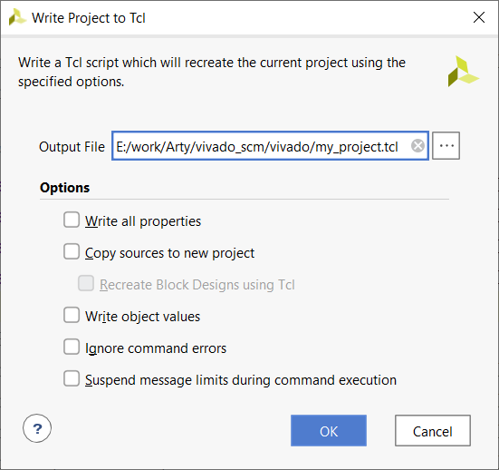

# vivado_scm
How to use Xilinx Vivado and git for source code control

## To re-create the project do the following:

### Clone the repository

### Enter the vivado directory from the Tcl Console

### Source tcl import script

### Wait a little...

### Generated Output Products for the Block Design

### Use Out-of-Content per IP (doesn't really matter though)

### Generate Bitstream

## How to create a Vivado project from scratch and to export it for source control

### Create a new project

### Just hit next

### Name the project whatever you like

### Select the RTL Project type, no need to specify sources at this time.  If you do specify sources, make sure they are outside the path of the project itself.

### I am using the Arty Artix-7 A100T edition of the board (USD 250)

### Click finish

### Create a Block Design

### Name it whatever you like, but click on the directory.

### Click Choose Location

### I used the src/bd directory

### I left out the rest, but I created a full block design

### This is my directory structure for storing files.  I found this structure on other websites.  Make sure this directory structure is outside the directory where the vivado project is located.

### Export the Hardware and include the bitstream - but wait... don't click ok.

### Select the src/sdk directory

### Now back to the launch SDK option, notice the changes

### Find your com port and connect to it using 9600 baud rate.

### Click File->Project->Write Tcl...

### I put this file in the parent directory of where the actual project is

### Success

### Take a look at the tcl

### Use the git_add.py Python3 script to parse this tcl file to add only the necessary files to source control

### Output shows which files were added.

### Final Screenshot

